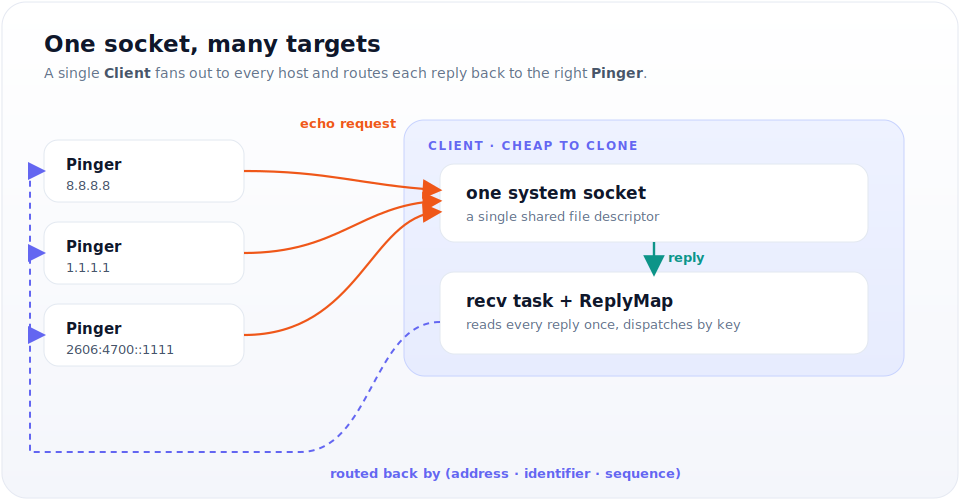

# surge-ping

Asynchronous ICMP ping library for Rust, built on `tokio` + `socket2` + `pnet_packet`.

[](https://crates.io/crates/surge-ping)
[](https://docs.rs/surge-ping)
[](https://github.com/kolapapa/surge-ping/blob/main/LICENSE)

`surge-ping` lets you send ICMP echo requests and await the replies from async
Rust. A single `Client` owns one system socket and can be cloned cheaply across
tasks, so you can ping thousands of hosts concurrently without opening thousands
of sockets.

## Features

- **Async / await** — powered by `tokio`, non-blocking from the ground up.
- **IPv4 & IPv6** — full ICMP and ICMPv6 support.
- **One socket, many targets** — clone a `Client` across tasks and multiplex
  replies by identifier/sequence (thanks [@wladwm](https://github.com/wladwm)).
- **Non-privileged ping on Linux** — uses `DGRAM` sockets when available, so no
  `root` or `CAP_NET_RAW` required. Falls back to `RAW` sockets elsewhere.
- **Configurable sockets** — bind address, interface, TTL, and more via
  `ConfigBuilder`.

## How it works

The usual approach — one socket per target — doesn't scale: pinging 10,000
hosts would open 10,000 sockets. `surge-ping` instead shares **one** socket
across every target.

A `Client` wraps a single system socket and spawns one background receive task.
Each `Pinger` you derive sends its echo request through that shared socket and
registers as a waiter keyed by `(address, identifier, sequence)`. The receive
task reads every incoming reply once and routes it back to the exact `Pinger`
waiting for it. Cloning a `Client` is cheap, so you can fan out across thousands
of tasks while holding just one file descriptor.



## Installation

```shell
cargo add surge-ping
cargo add tokio --features full
```

Or add it to `Cargo.toml` manually:

```toml
[dependencies]
surge-ping = "0.9"
tokio = { version = "1", features = ["full"] }
```

The `Client` example below also uses `rand` to generate an identifier:
`cargo add rand`.

## Quick start

The `ping` shortcut is the fastest way to send a single echo request. It creates
an internal `Client` on every call, so reach for `Client` directly (below) when
pinging more than one target.

```rust
#[tokio::main]
async fn main() -> Result<(), Box<dyn std::error::Error>> {
    let payload = [0; 8];
    let (_packet, duration) = surge_ping::ping("127.0.0.1".parse()?, &payload).await?;

    println!("Ping took {:.3?}", duration);
    Ok(())
}
```

## Recommended usage

For repeated pings or many targets, create one `Client` and derive a `Pinger`
per host. Each `Pinger` is identified by a `PingIdentifier`, and every echo
request carries a `PingSequence`.

```rust
use std::time::Duration;

use rand::random;
use surge_ping::{Client, Config, IcmpPacket, PingIdentifier, PingSequence};

#[tokio::main]
async fn main() -> Result<(), Box<dyn std::error::Error>> {
    let client = Client::new(&Config::default())?;
    let mut pinger = client.pinger("8.8.8.8".parse()?, PingIdentifier(random())).await;
    pinger.timeout(Duration::from_secs(1));

    for seq in 0..5 {
        match pinger.ping(PingSequence(seq), &[0; 56]).await {
            Ok((IcmpPacket::V4(reply), dur)) => println!(
                "{} bytes from {}: icmp_seq={} ttl={:?} time={:.2?}",
                reply.get_size(), reply.get_source(), reply.get_sequence(), reply.get_ttl(), dur,
            ),
            Ok((IcmpPacket::V6(reply), dur)) => println!(
                "{} bytes from {}: icmp_seq={} hlim={} time={:.2?}",
                reply.get_size(), reply.get_source(), reply.get_sequence(), reply.get_max_hop_limit(), dur,
            ),
            Err(e) => println!("seq={seq} error: {e}"),
        }
    }
    Ok(())
}
```

Clone the `Client` into separate tasks to ping many hosts over the same socket —
see [`examples/multi_ping.rs`](examples/multi_ping.rs).

## Examples

Three runnable examples ship with the crate:

```shell
git clone https://github.com/kolapapa/surge-ping.git
cd surge-ping

# One-shot ping with a chosen payload size
$ cargo run --example simple -- -h 8.8.8.8 -s 56
V4(Icmpv4Packet { source: 8.8.8.8, ttl: 53, icmp_type: IcmpType(0), size: 64, sequence: 0, .. }) 112.36ms

# A ping(8)-style CLI with statistics
$ cargo run --example cmd -- -h google.com -c 5
PING google.com (172.217.24.238): 56 data bytes
64 bytes from 172.217.24.238: icmp_seq=0 ttl=115 time=109.902 ms
64 bytes from 172.217.24.238: icmp_seq=1 ttl=115 time=73.684 ms
...
--- google.com ping statistics ---
5 packets transmitted, 5 packets received, 0.00% packet loss
round-trip min/avg/max/stddev = 65.865/76.897/109.902/16.734 ms

# Ping many IPv4/IPv6 hosts concurrently from one client
$ cargo run --example multi_ping
```

## Non-privileged ping (Linux)

On Linux (kernel 2.6.30+), `surge-ping` can use unprivileged ICMP `DGRAM`
sockets, so ping works without `root` or `CAP_NET_RAW`. It tries socket types in
this order and uses the first that succeeds:

1. **`DGRAM`** — non-privileged, subject to the `ICMP ECHO` restriction.
2. **`RAW`** — requires `root` / `CAP_NET_RAW`; the fallback on other systems.

If you hit `Permission denied`, check that unprivileged ICMP is enabled for your
group range:

```bash
# Inspect the current range (enabled looks like "0   2147483647")
sysctl net.ipv4.ping_group_range

# Enable for all groups (temporary)
sudo sysctl -w net.ipv4.ping_group_range="0 2147483647"

# Persist across reboots
echo "net.ipv4.ping_group_range=0 2147483647" | sudo tee -a /etc/sysctl.conf
sudo sysctl -p
```

As a last resort, run the binary with `sudo` or grant it the capability:

```bash
sudo setcap cap_net_raw+ep your-binary
```

Some container runtimes impose additional restrictions beyond `ping_group_range`.

## A note on timing accuracy

If your measurements are **time-sensitive**, be cautious with async ping. When a
large number of tasks are waiting to wake up, scheduling latency skews the
round-trip time. For precise measurements, prefer the operating system's native
`ping` command.

## License

Licensed under the [MIT license](LICENSE).
